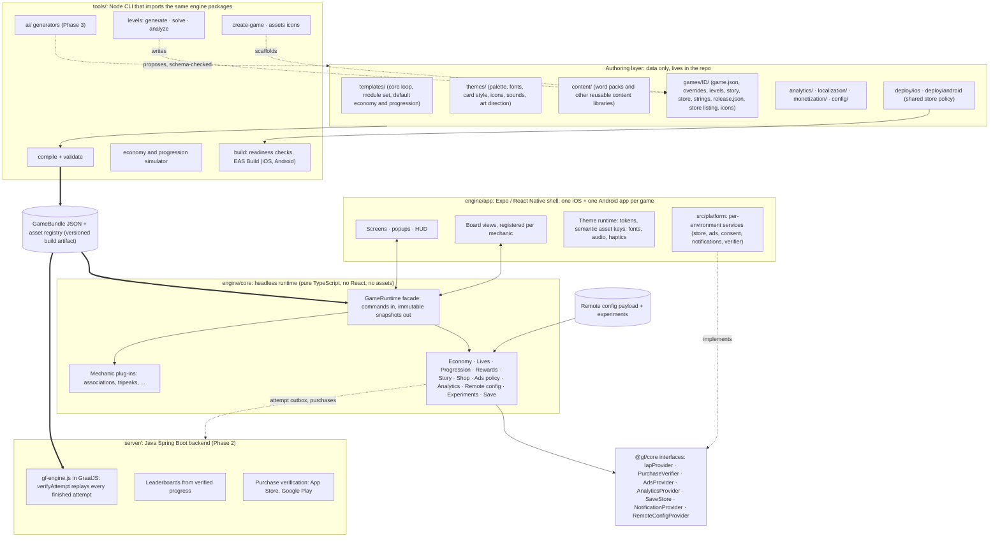
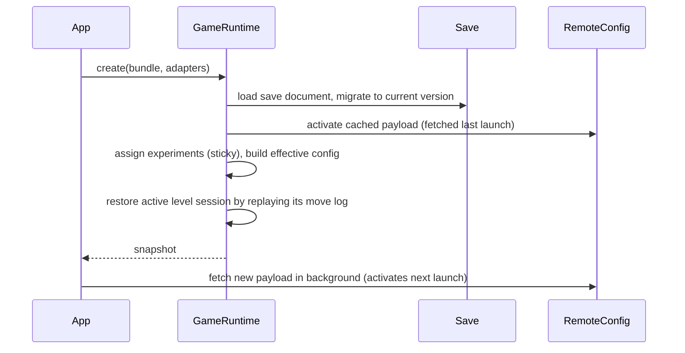
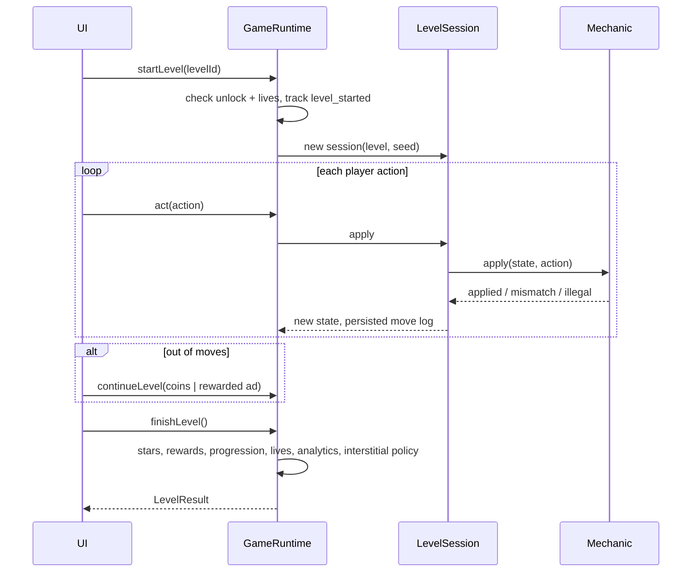

# A. Architecture

> **Core principle:** ONE CODEBASE. ONE GAME STACK. TWO MOBILE PLATFORMS. VARIABLE CONTENT.
> CODE IS SHARED. CONTENT IS VARIABLE. THEME IS VARIABLE. GAME RULES ARE CONFIGURABLE. PLATFORM CODE IS MINIMAL.
>
> A game is a *package of data* (configuration, content, theme, store identity, assets) that is
> compiled into a validated **GameBundle** and executed by one shared runtime, inside one app shell that
> produces an iOS app and an Android app per game. A new game never forks the code.

## 1. System overview



The same `GameRuntime` runs in three hosts:

| Host | Uses it for |
|---|---|
| Expo app (iOS, Android; web for development) | The shipped game. UI renders snapshots and sends commands. |
| Node tools | Simulation of thousands of player sessions, level analysis with bots, golden playthrough tests. |
| Java backend (Phase 2), through GraalJS | `verifyAttempt`, compiled into `gf-engine.js` by `gf server-engine`, replays every submitted attempt with the identical rules engine for leaderboards and reward validation. No port ([L](12-backend.md)). |

## 2. What varies per game, and the frame that does not

The games are simple: one core puzzle repeated over hundreds of levels, wrapped in the same meta loop.
So the **frame** is built once and never forked, while every game may bring its own **board**: its own
rules and its own look, 2D or 3D. Different boards are expected and fine; a different frame is not.

| Varies per game | The frame: identical in every game |
|---|---|
| Core mechanic: rules, level format, generator, solver, bots | App shell, navigation, popups, HUD, settings, tutorial overlay |
| Board view: rendering (2D, 2.5D or 3D), input (tap, drag, swipe), animation, effects | Journey map, chapters, stars, progression, story beats |
| Theme: art direction, palette, fonts, sounds, board skin | Economy, lives, the booster framework, rewards, shop |
| Content: levels, words, story, characters | Ads, purchases, consent, analytics, remote config, experiments |
| Meta mix: which modules are on (story, buildings, collections, events, leaderboards) | Save, attempt outbox, backend contracts and verification |
| Tuning: economy values, difficulty curve | Platform layer, release configuration, build and release pipeline |
| Store identity, listing, icons | Tools: compile, validate, level generation, bots, simulator, readiness checks |

A board is a mechanic plug-in (pure rules, §5) plus a board view (presentation, §9). A new game needs
nothing else from code, and often not even that: Palm Peaks reused TriPeaks, and a second sort game can
reuse the sort mechanic with another rules variant, board view or skin.

### Reference portfolio

| Reference (structure only) | Mechanic | Input | Win | Limit and loss | Typical boosters | Board rendering | Status |
|---|---|---|---|---|---|---|---|
| Solitaire Associations Journey | `associations`: sort word cards into categories | tap a card, tap a target | every category complete | move budget; stuck | hint, undo, joker, extra moves | 2D cards (views, SVG) | done: Maplebrook |
| Water Sort, Magic Sort | `sort` (planned): pour the top color onto a matching color or into an empty tube with room | tap a tube, tap a tube | every tube holds one color | none or a move budget; stuck | undo, hint, extra tube, shuffle | 2D or 2.5D glass and liquid (Skia) | Phase 2 |
| Jungle Bird Sort | `sort`, rules variant: branches of four, a full branch of one color flies away | tap a branch, tap a branch | every bird gone | stuck | undo, extra branch, shuffle | 2D sprites with Rive or Lottie animation | Phase 2: same rules engine, own board view and skin |
| Amaze GO! | `maze_paint` (planned): the ball slides to the next wall, painting its path | swipe | every floor tile painted | usually none; stars by moves against par | hint (next swipe), undo | 3D or isometric maze (three.js through expo-gl, or Skia) | Phase 2 |
| TriPeaks | `tripeaks` | tap a card | all peaks cleared | stock; stuck | hint, undo, joker | 2D cards | done: Palm Peaks |

Only the structure of these games is a reference. Sorting colors or painting a maze are genre
conventions; names, art, levels and text are original (see H and I), and every game must still differ
from the others enough to pass the stores' spam rules ([J §8](10-release-pipeline.md)).

### What the frame needs for these genres

The current contract was shaped by two card games. Every new genre is checked against it before its
plug-in is written. Known extensions, each added when the first mechanic needs it:

| Need | Change | Arrives with |
|---|---|---|
| Levels without a move limit | `BudgetInfo.kind` gains `"none"`; the HUD hides the counter; the mechanic's stars come from moves against par | `sort` |
| An extra empty container as a booster | shared booster effect `add_slot`, implemented by mechanics that declare it | `sort` |
| A board skin per genre (glass and liquid, birds and branches, maze tiles and ball) | `ThemeDefinition` keeps the frame tokens; card tokens move into a board skin whose schema the mechanic owns, like its level data (theme `schemaVersion` 2 with a migration) | the first non-card mechanic |
| 3D boards | asset type `model` (glTF) in themes; a board view may render a GL surface (expo-gl and three.js) while the frame around it stays React Native | `maze_paint` |
| Genre-specific analytics events | mechanics declare their events as a taxonomy fragment, replacing the runtime's built-in mapping | `sort` |
| A template for non-card puzzles | `puzzle_adventure` (the requirements' template C): its own required icons, sounds and module defaults | `sort` |

Everything else already works for any mechanic that implements `CoreMechanic`: undo, continues,
booster spending, the move log, stars and rewards, lives, attempt verification on the server, and
level generation from a difficulty curve tuned by bots.

## 3. Layers and dependency rules

```
games/*, themes/*, templates/*, content/*   data only, no code
        │ compiled by
tools/  ─────────────► engine/schemas, engine/core, engine/mechanics/*
server/ (Java, Phase 2) ► build/server-engine/gf-engine.js (compiled engine + mechanics), schemas/api.*.schema.json
engine/app ──────────► engine/core, engine/mechanics/*, generated bundle and release config
engine/app/src/platform ► SDK packages (the only code that knows the OS and the environment)
engine/mechanics/* ──► engine/core (interfaces only)
engine/core ─────────► engine/schemas
engine/schemas ──────► zod
```

Hard rules, enforced by review and by tests where possible:

1. `engine/core` and `engine/mechanics/*` never import React, React Native, Expo, or any asset.
   They run unchanged in Node.
2. Game logic never references a concrete asset, color, font or string. It references **ids**
   (item ids, card ids, level ids, string keys). The presentation layer resolves ids to visuals.
3. `games/*` contains no code. If a game needs behaviour that config cannot express, the behaviour
   becomes a configurable feature of a shared module, or a new mechanic plug-in.
4. Every economic value, price, reward, timer and ad frequency lives in configuration and can be
   overridden remotely. Code contains formulas, never numbers that a designer would tune.
5. The app consumes only the compiled `GameBundle` and the resolved release configuration. It never
   reads authoring files, so authoring formats can evolve behind the compiler's migrations.
6. Store-specific information lives in release configuration, never in `game.json` or code. Platform
   services are chosen per environment in one place, and production never runs a mock ([F](06-ios-android-architecture.md)).

## 4. Module map

Status column: **P1** = implemented in the Phase 1 vertical slice, **P2+** = schema and
interface defined now, implementation in a later phase.

| Module | Responsibility | Config | Status |
|---|---|---|---|
| Game loop / LevelSession | Start, act, undo, continue, finish a level attempt. Keeps history and a replayable move log. | `levels.json` | P1 |
| Mechanic plug-in | Pure rules `(state, action) → state`, win and lose evaluation, hints, booster effects. | level `data` + `rules` | P1 (associations, tripeaks) |
| Level system | Level envelope, generator, solver, bot, difficulty analysis. | `levelgen.json` | P1 |
| Difficulty | Difficulty curve for generation, bot win-rate estimate, remote move bonus. | `levelgen.json`, remote | P1 |
| Progression | Chapters, linear unlocks, stars, chapter completion. | `progression.json` | P1 |
| Player profile | Identity, settings, flags, experiment assignment. | n/a | P1 |
| Save / load | Versioned save document, migrations, resumable sessions. | n/a | P1 |
| Inventory and currency | Every countable thing is an item: coins, gems, boosters, tickets, collectibles. | `economy.json` | P1 |
| Energy (lives) | Count plus anchor timestamp regeneration, correct across restarts. | `economy.json` | P1 |
| Rewards | Reward bundles for level stars, chapter completion, offers. | `economy.json`, `progression.json` | P1 |
| Map / world | Journey path of chapters and nodes. Rendering is theme-driven. | `progression.json`, theme | P1 |
| Story | Dialogue beats triggered by progression events. | `story.json`, `characters.json` | P1 |
| Shop | Coin offers and IAP products defined as data. | `store.json` | P1 |
| Ads | Placement policy (frequency caps, min level, remove-ads entitlement) + provider interface. | `monetization.json` | P1 (mock provider) |
| IAP | Product catalog; two-phase purchases (verify, grant, save, finish); recovery of unfinished transactions; restore; entitlements. | `store.json`, `release.json` SKUs | P1 (mock store and verifier) |
| Attempt verification | `verifyAttempt` replays a finished attempt for the backend; the client keeps an outbox. | levels, economy, tuning | P1 (server in P2) |
| Leaderboards | Boards from verified progress only. | `leaderboards.json` | config P1, server P2 |
| Platform layer | Per-environment choice of store, ads, consent, notifications, verifier; production never mocked. | `capabilities.json` | P1 (stand-ins; real adapters P2) |
| Release configuration | Store identity, native settings, endpoints, listing, icons. | `release.json`, `deploy/*`, `store/*`, `assets/` | P1 |
| Analytics | Typed taxonomy, common params, provider fan-out, validation in dev. | `analytics/events.json` | P1 |
| Remote config | Layered overrides with schema validation and last-known-good cache. | `config/remote/*` | P1 |
| A/B testing | Deterministic sticky bucketing, variants are override sets. | remote payload | P1 |
| Localization | String tables per locale, content packs per locale, fallback chain. | `localization/*` | P1 (en) |
| Missions / quests | Objective tracking on domain events. | `quests.json` | P2 |
| Collections | Sets of collectibles earned from play. | `collections.json` | P2 |
| Buildings / upgrades | Restoration meta with star or coin costs. | `buildings.json` | P2 |
| Daily rewards | Calendar rewards with streaks. | `economy.json` | P2 |
| LiveOps events | Time-boxed events with own rules, rewards and theme overlays. | `events.json` | P2 |
| Notifications | Local notifications planned by the runtime (lives full now, daily reward later), scheduled on background. | strings, economy timers | seam and plan P1, adapter P2 |

Each meta module is independently enabled in `game.json`:

```json
"modules": { "map": true, "story": true, "lives": true, "boosters": true, "shop": true,
             "ads": true, "iap": true, "collections": false, "quests": false, "buildings": false,
             "notifications": false, "leaderboards": false }
```

## 5. The mechanic plug-in boundary

The single most important abstraction. A mechanic is a pure module that owns its level data
format and its rules. Everything around it (economy, lives, boosters, map, analytics, saving,
continues) is shared.

```ts
interface CoreMechanic<LevelData, State, Action> {
  id: string;                                    // "associations", "tripeaks"
  levelDataSchema: ZodType<LevelData>;           // validated at compile time
  capabilities: BoosterEffect[];                 // "hint" | "auto_place" | "add_moves" | "shuffle"
  createState(level: LevelData, seed: string): State;
  apply(state: State, action: Action): MoveResult<State>;   // applied | mismatch | illegal
  status(state: State): "playing" | "won" | "lost";
  evaluate(state: State, level: LevelData): { stars: 0|1|2|3; score: number };
  hint(state: State, level: LevelData): Action | null;
  addMoves(state: State, n: number): State;
}
```

Undo, continues, the move log, booster spending and analytics are implemented once in
`LevelSession`, not in each mechanic. Board rendering is the only per-mechanic UI code,
selected by `mechanic.id` from a registry in the app.

Input and rendering belong to the board view. A mechanic only defines actions (a card move, a pour,
a swipe direction); the board view turns taps, drags and swipes into them, and draws the state with
whatever suits the genre: React Native views and SVG for cards, Skia for liquids and particles, Rive or
Lottie for characters, a GL surface with three.js for 3D boards. The frame around the board (HUD,
popups, map, shop) is always the shared React Native UI.

## 6. Configuration layering

Three separate things, never mixed:

| Layer | Where | Changes by | Validated by |
|---|---|---|---|
| **Client code** | `engine/*` | App release (or OTA update of the JS bundle) | TypeScript, tests |
| **Game configuration** | `games/*` + `templates/*` + `themes/*` + `content/*`, compiled into the bundle | Content release | `gf compile` (schemas + cross-reference + solver) |
| **Remote configuration** | Remote payload: overrides + experiments | Ops, no release | Same zod schemas at runtime; invalid payloads are rejected |
| **Release configuration** | `games/ID/release.json` over `deploy/PLATFORM/defaults.json`, listing, icons | Store build | `gf validate`, `gf build` readiness checks; not part of the bundle or its content hash |

Resolution order at boot: `bundle defaults` ← `remote overrides` ← `experiment variant overrides`.
Only whitelisted roots are overridable remotely: `economy`, `monetization`, `store` and `tuning`
(difficulty knobs such as a global move bonus, plus feature flags). Levels, story and content are not remotely mutable in Phase 1, which keeps
replays and anti-cheat deterministic. A fetched payload is activated on the next launch, never
mid-session.

## 7. Determinism and replay

- One pinned PRNG (`sfc32` seeded by a string hash). Its output is part of the content contract:
  changing it is a breaking change (ADR-0002).
- Levels are stored as **explicit deals** in `levels.json`, not regenerated from seeds at runtime.
  Generator improvements never silently change shipped levels.
- A level attempt is recorded as `{levelId, seed, actions[]}`. Replaying the actions reproduces
  the state exactly. This is the resume mechanism today and the anti-cheat payload later.

## 8. Key flows

### Boot



### Level attempt



### Purchase and attempt verification

Purchases run in two phases (verify, grant, save, finish) with recovery at every launch; see the
sequence in [F §4](06-ios-android-architecture.md). Finished attempts go to an outbox and are replayed by
the backend; see [L §4](12-backend.md).

## 9. Presentation layer

Everything visual is replaceable without touching gameplay code:

- **Tokens:** palette, typography, radii, spacing and animation timings come from `ThemeDefinition`.
- **Semantic asset keys:** UI asks for `card.back`, `icon.coin`, `bg.map`, `sfx.place`. The theme
  maps each key to an emoji, an inline SVG, an image, a font or an audio file. Swapping a theme
  swaps every visual and sound.
- **Board views per mechanic:** 2D or 3D, each with its own input handling (§5). A card board view receives the mechanic state and a layout function
  and renders cards at computed positions with animated transforms.
- **Strings:** every visible string is a key resolved through the localization table.

## 10. Config versus code

| Configuration (data) | Code (shared, tested) |
|---|---|
| Level layouts, rules variants, move budgets, star thresholds | Rules engines, solver, generator, bot |
| Currencies, prices, rewards, booster amounts, lives timers | Wallet transactions, energy regeneration math, reward granting |
| Chapters, unlock gates, story beats, characters | Progression state machine, trigger evaluation |
| Shop catalog, IAP SKUs, ad placements, frequency caps | Purchase flow, entitlement handling, ad policy evaluation |
| Palette, fonts, card style, icons, sounds, animation timings | Theme runtime, board layout math, animation system |
| Analytics event taxonomy | Event pipeline, validation, provider adapters |
| Remote overrides, experiments | Layering, validation, bucketing |

## 11. Architectural risks

| Risk | Impact | Mitigation |
|---|---|---|
| Templates diverge into per-game forks | Factory economics collapse | Rule 3: no code in games. New needs become module features or mechanics. |
| Config sprawl without validation | Broken releases | Single zod source of truth, `gf validate` in CI, cross-reference and solver checks. |
| Generated levels impossible or dull | Churn | Solver verifies every level; bots estimate win rate; curve-driven generation. |
| Economy inflation or grind | Retention and revenue loss | Simulator runs the real runtime with bot players before every release. |
| React Native performance for VFX-heavy scenes | Jank on low-end Android | A shared game-feel module in Phase 2 (Reanimated, Skia particles, Rive) driven by theme tokens; board animations on the UI thread; profile on a mid-range Android phone. |
| Ad and IAP SDK churn | Release blockers | Provider interfaces with mock implementations; SDKs isolated in adapters. |
| Remote config breaks a live game | Outage without a release | Schema validation, whitelisted roots, last-known-good fallback, activation on next launch. |
| Save format changes lose progress | Player anger | Versioned save document with tested migrations; never mutate shipped formats in place. |
| AI content copies third-party IP | Store takedown, legal | Originality checks, blocklists, human review gate (see H and I). |
| Reskins rejected as spam (App Store 4.3, Play repetitive content) | A month's game blocked | `gf build` refuses production builds that differ from another game only by theme and content; vary mechanic, rules or meta. |
| Native config fails store review | Rejection | Permissions and background modes set by policy in `deploy/`; checked with config introspection; restore button for non-consumables. |
| Lost or duplicated purchases | Refunds, support load, fraud | Two-phase purchases, ledger of granted transactions, recovery at launch, server verification. |
| Server cannot replay old clients | Valid players flagged | Bundle registry by content hash, mechanic versions, `unverifiable` is never treated as cheating. |
| Google Play testing gate for new personal accounts (12 testers, 14 days per app) | Monthly cadence slips | Publish from an organization account. |

## 12. Decisions log

| ADR | Decision |
|---|---|
| [0001](adr/0001-technology-stack.md) | TypeScript monorepo, Expo / React Native client. See [B](02-technology-decision.md). |
| [0002](adr/0002-determinism-and-explicit-levels.md) | Pinned PRNG, levels stored as explicit deals, move-log replay. |
| [0003](adr/0003-compile-step-and-config-layering.md) | Authoring files compile into a versioned GameBundle; remote overrides layer on top. |
| [0004](adr/0004-association-is-the-puzzle.md) | The UI never auto-routes word cards; the player chooses the destination. |
| [0005](adr/0005-bot-tuned-difficulty.md) | Budgets are tuned to target win rates measured with imperfect-information bots. |
| [0006](adr/0006-platform-layer.md) | Platform services behind interfaces, chosen per environment; production never mocked. |
| [0007](adr/0007-backend-trust-boundaries.md) | Java backend that runs the client's engine through GraalJS; trust boundaries. |
| [0008](adr/0008-two-phase-purchases.md) | Two-phase purchases, verified before granting. |
| [0009](adr/0009-release-config.md) | Store-specific configuration in release config; `game.json` v2. |
| [0010](adr/0010-unified-frame-variable-boards.md) | One frame for every game; boards (rules, 2D or 3D view, input) vary per game. |
