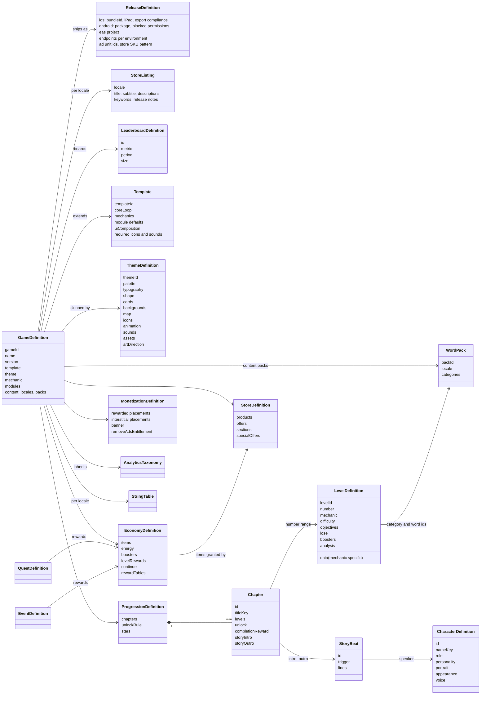
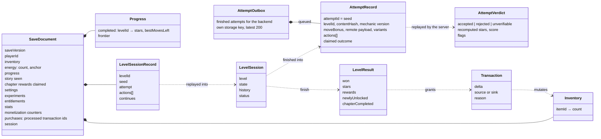

# C. Domain model

The domain splits into **definitions** (authored data, immutable at runtime, compiled into the
GameBundle) and **runtime state** (owned by the player, persisted in the save document).

## 1. Definitions (authored data)

## 2. Runtime state (player owned)

## 3. Entities

| Entity | Identity | Owned by | Notes |
|---|---|---|---|
| GameDefinition | `gameId` | `games/ID/game.json` | Root of a game. Names a template, a theme and a mechanic. |
| Template | `templateId` | `templates/ID/` | Core loop, default module set, default economy and store, required icons and sounds. |
| ThemeDefinition | `themeId` | `themes/ID/` | All visual and audio identity. Reusable across games. |
| WordPack | `packId` + `locale` | `content/word-packs/LOCALE/` | Categories and words. Reusable across games. |
| LevelDefinition | `levelId` | `games/ID/levels.json` | Generic envelope plus mechanic-specific `data`. |
| Item | `itemId` | `economy.json` | Everything countable: coins, gems, lives, boosters, tickets, collectibles, entitlements. |
| RewardBundle | inline or `rewardTables` id | `economy.json` | A bag of item amounts, e.g. `{"coins": 50, "hint": 1}`. |
| Chapter | `chapterId` | `progression.json` | Range of levels, unlock rule, completion reward, story beats. |
| Character | `characterId` | `characters.json` | Name, role, portrait reference, art and voice notes for AI generation. |
| StoryBeat | `beatId` | `story.json` | Trigger plus dialogue lines. Shown once. |
| Product | `productId` | `store.json` | IAP SKU with contents. The store supplies the price. |
| Offer | `offerId` | `store.json` | Soft-currency purchase with contents. |
| Quest | `questId` | `quests.json` | Objective on a domain event, with a reward (P2). |
| LiveOps event | `eventId` | `events.json` | Schedule, eligibility, rules, milestones, theme overlay (P2). |
| Experiment | `experimentId` | remote payload | Weighted variants, each an override set. |
| ReleaseDefinition | `gameId` | `games/ID/release.json` over `deploy/PLATFORM/defaults.json` | Store identity, native settings, endpoints, ad unit ids, SKU pattern. Not part of the bundle. |
| StoreListing | `gameId` + `locale` | `games/ID/store/LOCALE.json` | Listing text within both stores' limits. |
| LeaderboardDefinition | `boardId` | `leaderboards.json` | Metric and period; values only from verified attempts. |
| StoreTransaction | `transactionId` | the store, then the save's `purchases.processed` | Granted at most once; finished only after the grant is saved. |
| AttemptRecord | `attemptId` (= seed `player:level:attempt`) | the attempt outbox (`gf.outbox.ID` in device storage), then the backend | Replayable proof of one attempt. |
| SaveDocument | `playerId` | device storage (verified copy on the server) | Versioned. Migrated on load. |
| LevelSession | `levelId` + attempt | memory, persisted as a record | Replayable from `seed` and `actions`. |

## 4. Identifier conventions

- Lowercase snake or dotted ids: `maplebrook`, `cozy_village`, `fruits`, `fruits.apple`.
- Level ids are namespaced by game: `maplebrook.l001`. Card ids are namespaced by kind:
  `c.fruits` for a category card and `w.fruits.apple` for a word card.
- String keys are dotted and scoped: `ui.map.play`, `story.ch1.intro.1`, `content.cat.fruits`,
  `content.word.fruits.apple`.
- Ids are stable forever once shipped. Renaming an id is a migration, not an edit.

## 5. Invariants checked by the compiler

1. Every id is unique within its collection, and level numbers are contiguous from 1.
2. Every reference resolves: template, theme, mechanic, packs, categories, words, items, reward
   tables, story beats, characters, products, icons, sounds and assets.
3. Every chapter range covers existing levels, chapters do not overlap, and together they cover
   every level.
4. Every string key used by the bundle exists in every shipped locale.
5. Every level passes its mechanic's structural validation, and with `--deep` the solver finds a
   solution within the move budget.
6. Economy sanity: non-negative amounts, every booster has a price, energy refill cost is
   affordable from rewards within a bounded number of levels, rewards stay under configured caps.
