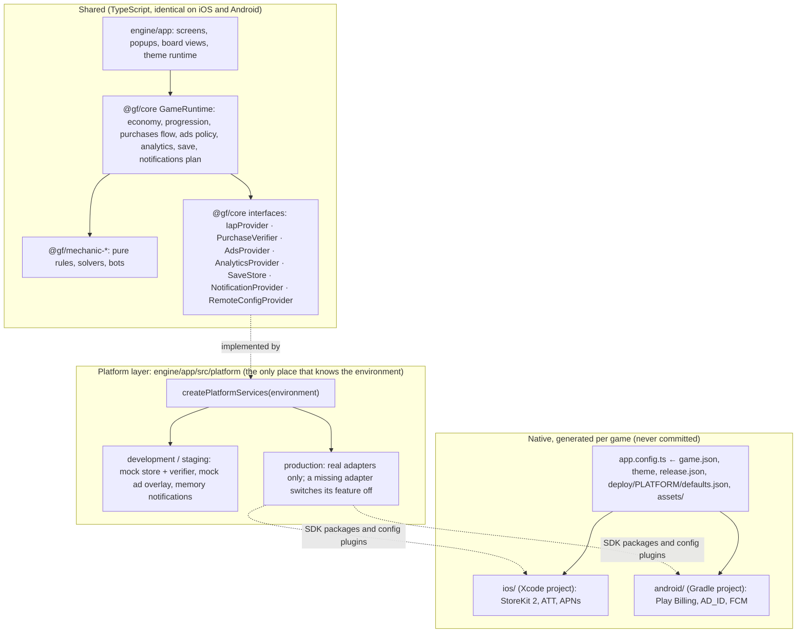

# F. iOS and Android architecture

> **One codebase. One game stack. Two mobile platforms. Variable content.** Everything above the
> platform layer is shared and runs unchanged on iOS, Android, the web preview and Node. The platform
> layer is a handful of adapters behind interfaces, chosen per build environment.

## 1. Layers



Gameplay never branches on the OS. The only `Platform.OS` reads in the app are the analytics
`platform` parameter and skipping haptics on web.

## 2. The platform service contract

The requirements name `IPurchaseService IAdsService IAnalyticsService ISaveService
INotificationService`. They map to these TypeScript interfaces (no `I` prefix, by TypeScript
convention):

| Requirement | Interface (`@gf/core`) | Development and staging | Production | Genuinely platform-specific |
|---|---|---|---|---|
| IPurchaseService | `IapProvider` (two-phase) + `PurchaseVerifier` | `MockIapProvider` + `MockPurchaseVerifier` | StoreKit 2 / Play Billing adapter + backend verifier (Phase 2) | Ask to Buy (iOS), pending payments and the 3-day acknowledgement window (Android), restore prompt (iOS) |
| IAdsService | `AdsProvider` | `MockAdsBridge` (full-screen overlay) | AdMob or AppLovin MAX adapter; ads off until it exists | IDFA and ATT (iOS), `AD_ID` permission (Android 13+) |
| IAnalyticsService | `AnalyticsProvider[]` | memory + console logger | memory + Firebase adapter | none beyond the SDK's own setup files |
| ISaveService | `SaveStore` | AsyncStorage | AsyncStorage; cloud copy through the backend | Keychain / Keystore for the backend install secret |
| INotificationService | `NotificationProvider` | `MemoryNotificationProvider` | expo-notifications adapter | permission prompt (iOS), `POST_NOTIFICATIONS` (Android 13+) |
| Consent | `ConsentProvider` (app) | conservative stand-in | Google UMP + App Tracking Transparency | ATT exists only on iOS |
| Remote config | `RemoteConfigProvider` | HTTPS URL per environment | same | none |
| Lifecycle | `AppState` → `startSession`, `endSession`, `reconcilePurchases` | same | same | none |
| Back navigation | `useBackHandler` | same | same | Android only; popups answer first |
| Platform sign-in | Phase 2: install credential, then Sign in with Apple / Google linking | | | Apple guideline 4.8 |

`engine/app/src/platform/capabilities.json` declares which real adapters exist. `gf build` refuses a
production build that would fall back to a development stand-in, and `createPlatformServices` never
returns a mock in production: a feature without its real adapter is switched off (no ads, no store).

## 3. Environments

| | development | staging | production |
|---|---|---|---|
| EAS profile | `development` (iOS simulator build, Android APK) | `staging` (internal distribution) | `production` (store, auto-incremented build number) |
| EAS environment | development | preview | production |
| Platform services | development stand-ins | development stand-ins, warned by `gf build` | real adapters only |
| Endpoints | `release.json` `environments.development` | `environments.staging` | `environments.production` |
| Purchases | mock store, verified locally | mock store (real sandbox in Phase 2) | StoreKit / Play Billing, verified by the backend |

`APP_ENV` is set by the EAS profile (or the local shell). `app.config.ts` writes it to
`extra.environment`, and `platform/environment.ts` reads it through `expo-constants`.

## 4. Purchases end to end

```mermaid
sequenceDiagram
  participant UI as Shop
  participant RT as GameRuntime
  participant S as IapProvider (StoreKit / Play Billing)
  participant V as PurchaseVerifier (backend)
  participant D as SaveStore
  UI->>RT: purchaseProduct(id)
  RT->>S: purchase(id)
  S-->>RT: purchased(transaction) | pending | cancelled | failed
  RT->>V: verify(transaction)
  alt verified
    RT->>RT: grant contents and entitlements, record transaction id
    RT->>D: save (awaited)
    RT->>S: finish(transaction)
  else invalid (forged, refunded, other app)
    RT->>S: finish(transaction), grant nothing
  else unavailable (offline, backend down)
    RT-->>UI: "arrives as soon as we can confirm it"; transaction stays with the store
  end
  Note over RT,S: Every launch and foreground: reconcilePurchases() delivers unfinished transactions exactly once
```

- **Exactly once.** Granted transaction ids are kept in the save (`purchases.processed`). A transaction
  the store delivers again is finished without a second grant.
- **Nothing lost.** The store forgets a transaction only after the grant is on disk. A kill between
  payment and grant leaves it with the store, and the next launch delivers it.
- **Restore.** `restorePurchases()` is user-initiated (the shop's Restore button, required by App Store
  review for non-consumables). It brings back entitlements such as `no_ads` and never re-grants
  consumables.
- **Refunds and revocations** reach the backend through App Store Server Notifications and Google
  real-time developer notifications (see [L](12-backend.md)).

## 5. Native configuration

Native projects are generated by `expo prebuild` from `engine/app/app.config.ts` (Continuous Native
Generation) and never committed. The config reads only data:

| Native setting | Source |
|---|---|
| App name, marketing version | `games/ID/game.json` |
| Bundle id, package, iPad support, export compliance, blocked permissions, EAS project | `games/ID/release.json` over `deploy/PLATFORM/defaults.json` |
| Icon, adaptive icon, monochrome icon, splash, favicon | `games/ID/assets/*.png` (placeholders from `gf assets icons`) |
| Splash and adaptive-icon background colors | the theme palette |
| Store SKUs | `release.json` `iap.skuPattern` (`{appId}.{productId}`), overridable per product in `store.json` |

**Permission policy.** A card game needs the network and vibration. `expo-audio` defaults would add a
microphone usage string, background audio mode and a media-playback foreground service; App Store
guideline 2.5.4 rejects unused background modes and Google Play requires a justified declaration for
foreground services. The plugin is configured for playback only, and the Android defaults block
`RECORD_AUDIO`, `FOREGROUND_SERVICE`, `FOREGROUND_SERVICE_MEDIA_PLAYBACK`, `READ/WRITE_EXTERNAL_STORAGE`
and `SYSTEM_ALERT_WINDOW`. Verified with `npx expo config --type introspect` for both games: the merged
manifest keeps `INTERNET`, `VIBRATE` and `MODIFY_AUDIO_SETTINGS`; the Info.plist has no background
modes and no usage strings.

**Native code policy.** Anything native arrives as an Expo module or SDK package with a config plugin.
If the factory ever needs its own native code, it goes into `engine/app/modules/` (local Expo modules,
Swift and Kotlin) and `engine/app/plugins/` (config plugins), shared by every game. A game package
never contains native code.

## 6. Platform-specific concerns

| Concern | iOS | Android | Where it is handled |
|---|---|---|---|
| Back navigation | none | system back button | `useBackHandler`: popups close, the board asks before leaving, the map lets the OS background the app |
| Tracking consent | ATT prompt before any IDFA use | none (UMP covers GDPR) | `ConsentProvider`, gathered before ads and analytics start |
| GDPR / UK consent | UMP | UMP | same |
| Purchases awaiting approval | Ask to Buy | pending payment methods | `pending` outcome, delivered by `reconcilePurchases()` |
| Unacknowledged purchases | redelivered until finished | auto-refunded after 3 days | `finish()` only after grant and save; retries every launch and foreground |
| Restore | required button for non-consumables | not required, harmless | shop Restore button |
| Notifications permission | prompt | runtime permission on Android 13+ | `requestNotificationPermission()`, asked at a moment of value, not at boot |
| Privacy declarations | privacy manifests (Expo modules ship theirs), App Privacy labels | Data safety form | release checklist ([J](10-release-pipeline.md)) |
| Background work | none (no background modes) | no foreground services | permission policy above |
| Tablets | `supportsTablet` per game, default false | runs on tablets | `release.json`; true requires iPad screenshots |
| Build host | Xcode on macOS: EAS cloud builds | Gradle: local or EAS | `gf build` |

## 7. Where the requirement folders live

| Requirement folder | Here | Why |
|---|---|---|
| `/platform` | `engine/app/src/platform/` | Adapters are TypeScript that imports SDK packages; they belong to the app shell. |
| `/platform/ios`, `/platform/android` | none committed; config plugins, later `engine/app/modules/` | Native projects are generated per game, so hand-written native folders would fork per game. |
| `/ios`, `/android` | generated by `expo prebuild`, gitignored | Continuous Native Generation |
| `/deploy/ios`, `/deploy/android` | `deploy/ios/defaults.json`, `deploy/android/defaults.json` | Shared store policy per platform |
| store metadata in the game package | `games/ID/release.json`, `games/ID/store/LOCALE.json`, `games/ID/assets/` | A game stays a small data package |

## 8. Status

| Item | State |
|---|---|
| Interfaces, two-phase purchases, restore, recovery, verification seam, notifications seam | done, tested headlessly (`engine/core/src/purchases.test.ts`) |
| Per-environment platform selection, production never mocked | done (`engine/app/src/platform/index.ts`) |
| Native identity, permissions, icons, splash from release config | done, verified by config introspection |
| Android back handling | done, typechecked; not yet exercised on a device |
| Native iOS and Android builds | not run yet: needs an EAS project per game (no Xcode on the development Mac) |
| Real StoreKit / Play Billing, AdMob or MAX, UMP + ATT, Firebase, expo-notifications adapters | Phase 2, with a development build |
