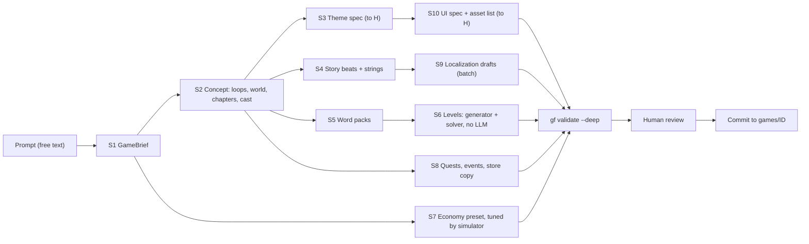

# H. AI content pipeline

**Status:** design. Phase 1 ships the schemas, the JSON Schema export, the validators and the
deterministic generators this pipeline depends on. The model calls arrive in Phase 3.

## Principles

1. **Models write creative content. Tools compute numbers and layouts.** A language model writes
   briefs, characters, dialogue, word categories, quest copy and localization drafts. It never
   hand-writes level layouts or economy values. Levels come from the generator and solver.
   Economy values come from template presets tuned by the simulator.
2. **Schema-bound output.** Every call uses structured outputs bound to the same zod schema that
   validates the file in the game package. A response that parses is already the right shape.
3. **Validate, then repair.** The compiler's domain validators run on every draft. Their findings
   go back to the model as data in a new turn, up to a bounded number of attempts.
4. **Stages are checkpoints.** Each stage writes files, gets reviewed, and becomes the input of
   the next. Any stage can be regenerated alone.
5. **Original by construction.** Prompts forbid existing franchises. A blocklist and a judge call
   check outputs. A human approves the concept, the theme and the final package.

## Pipeline



| Stage | Output schema | Notes |
|---|---|---|
| S1 GameBrief | `GameBrief` (title options, pitch, audience, tone, template, mechanic, modules, monetization style) | Maps the prompt to factory choices. |
| S2 Concept | `ConceptDraft` (core loop, meta loop, chapters, locations, `CharacterDefinition[]`) | Chapters become `progression.json`. |
| S3 Theme spec | `ThemeDefinition` minus `assets` | Palette roles, font choice from the font catalog, art direction. |
| S4 Story | `StoryFile` + string table entries | One intro and one outro beat per chapter in Phase 3. |
| S5 Word packs | `WordPack` | See the dedicated section below. |
| S6 Levels | `LevelsFile` | `gf levels generate`. The model may only pick a curve preset. |
| S7 Economy | `EconomyDefinition` overrides | Preset (relaxed, standard, tight), then simulator tuning. |
| S8 Quests and events | `QuestsFile`, `EventsFile`, store titles | Rewards are chosen from reward tables, not invented. |
| S9 Localization | `StringTable` per locale | Batch API. Word packs are re-authored per locale, not translated. |
| S10 UI and asset list | Asset briefs keyed by the template's required asset keys | Feeds the asset pipeline. |

Drafts go to `ai/out/GAME/STAGE.json` with a sidecar `STAGE.meta.json` (model, prompt version,
input hash, date, usage). `gf ai accept GAME STAGE` validates and promotes a draft into the game
package. Provenance stays out of the game files, so their schemas stay strict.

## Calling the model

TypeScript SDK, structured outputs from zod (`messages.parse` with `zodOutputFormat`):

```ts
import Anthropic from "@anthropic-ai/sdk";
import { zodOutputFormat } from "@anthropic-ai/sdk/helpers/zod";
import { WordPackSchema } from "@gf/schemas";

const client = new Anthropic();

const response = await client.messages.parse({
  model: "claude-opus-5-5",
  max_tokens: 16000,
  output_config: { effort: "high", format: zodOutputFormat(WordPackSchema) },
  system: [
    // Stable prefix: role, house rules, the game bible (brief, concept, theme). Cached.
    { type: "text", text: gameBible, cache_control: { type: "ephemeral" } },
  ],
  messages: [{ role: "user", content: stageInstructions }],
});

if (response.stop_reason === "refusal") {
  // Route to human review. Never read content after a refusal.
}
const draft = response.parsed_output; // null if parsing failed
```

Settings that matter:

- **Model:** `claude-opus-5-5` for every stage by default, configurable per stage in
  `ai/config.json`. Moving a stage to a cheaper model is a product decision, made only after an
  eval shows quality holds.
- **Effort:** `high` for concept, story and word packs. Measure `medium` or `low` for mechanical
  stages such as copy variants and localization checks. Opus 5.5 defaults to `medium`, so the
  pipeline always sets effort explicitly.
- **Refusals:** check `stop_reason` before reading output. Enable the API's server-side refusal
  fallback when the pipeline is implemented.
- **Repair turns:** append the validator report as a new user turn. Never edit earlier turns, so
  thinking blocks and the cache prefix stay valid.

## Cost control

| Lever | Use |
|---|---|
| Prompt caching | Byte-stable prefix (house rules + game bible) with a cache breakpoint. Volatile stage input goes after it. Verify with `usage.cache_read_input_tokens`. |
| Message Batches API | Localization drafts, bulk word-pack expansion, copy variants: 50% price, up to 100,000 requests per batch, results keyed by `custom_id`. |
| Effort per stage | Lower effort where an eval shows no quality loss. |
| Stage checkpoints | Regenerate one stage, not the whole game. |
| Usage logs | Every call records `usage` in the meta sidecar. `gf ai report` sums cost per game. |

Expected text cost per game is in single-digit dollars at current Opus 5.5 prices, dominated by
output and thinking tokens. Image generation, covered in H, costs more.

## Word packs: the content that makes or breaks this game

Generation constraints, enforced by the prompt and checked by validators:

1. Category names at most 18 characters. Words at most 12 characters so they fit a card.
2. Each word belongs to exactly one category of the pack. Duplicates across categories are errors.
3. Difficulty 1–5 per category. 1 is concrete and everyday ("Fruits"), 3 is themed ("Kitchen
   tools"), 5 is lateral ("Things with keys").
4. **Decoys are deliberate.** A word may tempt the player toward another category ("Salsa": dance
   or sauce) only when the intended category stays defensible.
5. Family friendly (4+), no brand names, no region-specific trivia unless the pack is locale
   specific.

Automated checks after parsing:

- Length, duplicates, profanity list, brand and franchise blocklist.
- **Human-solvability judge:** for each level, a separate call sees the level's category names and
  one word at a time and must pick the category. Words the judge misplaces are flagged as
  ambiguous. This catches broken associations that a solver cannot.
- Pack coverage: enough categories at each difficulty for the level curve.

## Localization

- UI strings and story: LLM drafts per locale through the Batch API, placeholder checks
  (`{count}` preserved), length checks against the English source, human review.
- Word content: **re-authored per locale.** Associations are cultural, so each locale gets its
  own pack and its own generated levels. Category ids are shared when the concept carries over.

## Originality and safety

- The prompt states the product must be original and names no existing game, studio or character.
- Blocklist of reference titles, studios, characters and trademarks, applied to every string.
- A judge call asks whether the content resembles an existing commercial game, with evidence.
- Humans approve the brief, the theme and the final package before anything is committed.

## Example prompt to factory output

Input:

> Create a casual solitaire adventure game themed around a mysterious tropical island. The player
> restores an abandoned resort by completing solitaire levels. Bright tropical visuals, relaxed
> progression, friendly characters, a light mystery story.

S1 maps it to: template `solitaire_adventure`, mechanic `tripeaks` or `associations`, modules
`map + story + buildings`, economy preset `relaxed`, theme family `tropical_resort`. S2 to S10
fill the package. `gf validate --deep` and the simulator gate it. The engine consumes the
result with no code changes.
