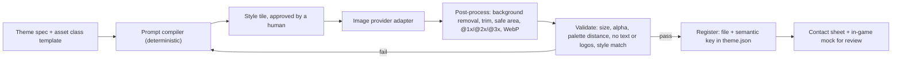

# I. AI asset pipeline

**Status:** design. Phase 1 ships the semantic asset keys, the theme schema with `artDirection`,
and procedural placeholder art, so every game is playable before real art exists.

## The theme specification

Art direction is data inside `ThemeDefinition.artDirection`, so an image model can follow it the
same way every time:

```ts
type ArtDirection = {
  styleKeywords: string[];        // "storybook gouache", "soft rim light"
  rendering: string;              // "flat vector with soft gradients"
  lineWork: string;               // "warm brown 2px outlines, rounded joins"
  lighting: string;               // "late afternoon key light from upper left"
  texture: string;                // "subtle paper grain"
  perspective: string;            // "3/4 top-down for the map, front-facing for UI"
  mood: string[];
  colorNotes: string;             // how palette roles are used
  characterStyle: string;         // proportions, faces, outfits
  negative: string[];             // "photorealism", "text", "logos", "watermarks", "existing franchises"
  referenceDescriptors: string[]; // descriptive, never IP: "19th-century botanical prints"
};
```

The palette hex values, typography and card style from the same theme are injected into every
prompt, so color and shape language stay consistent.

## Asset classes

Each template declares the semantic keys a game needs. A theme must provide every key, either as
real art or a placeholder.

| Class | Keys | Size and format | Constraints |
|---|---|---|---|
| Backgrounds | `bg.map`, `bg.map.CHAPTER`, `bg.level` | 1290×2796 WebP | Calm center for the board, no text |
| Cards | `card.back`, `card.face.frame`, `card.category.frame` | 300×408 PNG/SVG | Readable at 64 px wide, 9-slice safe border |
| Board skins (per mechanic) | e.g. `board.tube`, `board.liquid.*`, `board.branch`, `board.bird.*`, `board.tile.*`, `board.ball` | PNG/SVG sprites; glTF for 3D boards | Declared by the mechanic's skin schema; colors readable by color-blind players (shape or pattern cues) |
| UI | `ui.button.primary`, `ui.button.secondary`, `ui.panel`, `ui.ribbon` | 9-slice PNG | Measured insets stored with the asset |
| Icons | `icon.coin`, `icon.gem`, `icon.life`, `icon.star`, `icon.hint`, `icon.undo`, `icon.joker`, ... | 256×256 PNG, alpha | Recognizable at 24 px, single light source |
| Characters | `char.ID.portrait`, `char.ID.EMOTION` | 768×768 PNG, alpha | Built from an approved turnaround sheet |
| Buildings (P2) | `building.ID.ruined`, `building.ID.restored` | 1024×1024 PNG, alpha | Same footprint and camera in both states |
| Map | `map.decor.*`, `map.node.*` | 256–512 PNG, alpha | 3/4 top-down, matching shadow direction |
| VFX | `vfx.particle.*` | 64–128 PNG, alpha | Tinted at runtime by palette roles |
| Store and app identity | `games/ID/assets/`: `icon.png`, `adaptive-icon.png`, `adaptive-icon-monochrome.png`, `splash.png`; `store.feature_graphic`, screenshot frames | 1024×1024 (icon without alpha), 1024×500 | Platform guidelines; replaces the `gf assets icons` placeholders, which release checks flag |

## Pipeline



1. **Prompt compiler.** Assembles each prompt from the art direction, palette hex codes, the asset
   class template (composition, framing, size) and the negative list. Deterministic text, so a
   prompt change is a reviewable diff.
2. **Style tile first.** One approved tile per theme (a card, an icon, a background crop and a
   character head) becomes the reference image for every later generation.
3. **Provider adapters.** `ImageProvider` hides the vendor. The model and version per asset class
   are pinned in `themes/ID/assets.lock.json` along with prompt, seed and output hash, so the set
   is reproducible and auditable.
4. **Characters from turnarounds.** Generate and approve a turnaround sheet per character, then
   condition portraits and expressions on it.
5. **Post-processing** with `sharp`: alpha cleanup, trim and pad to the safe area, export at three
   densities, WebP for opaque art, PNG for alpha icons, 9-slice inset measurement.
6. **Validation:** dimensions, alpha presence, file-size budget, dominant-color distance to the
   palette (CIEDE2000), text contrast for UI art, and a vision check (Claude reading the image)
   for stray text, logos, watermarks and style drift against the style tile.
7. **Registration.** Files land in `themes/ID/assets/`. The theme's `assets` map points semantic
   keys to them. No code changes.
8. **Review.** An HTML contact sheet shows every asset on the palette and composed into mock game
   screens. A human approves the set.

## Animation, VFX, music and sound

- **Animations** are data: timings and easing in `theme.animation`, with tween presets in code.
- **VFX** are parametric effects in code (confetti, leaves, bubbles, sparkles), tinted by palette
  roles and glyphs from `theme.vfx`. Lottie or Rive files can be registered as assets later.
- **Sound** comes from curated royalty-free packs or audio generation, normalized to -16 LUFS,
  registered under semantic sound keys (`tap`, `place`, `mismatch`, `complete`, `win`, `lose`,
  `coin`). Phase 1 synthesizes placeholder blips.

## Marketing screenshots

Real gameplay rendered from the web build with Playwright at store resolutions, composited into
localized caption frames with HTML templates. Final native captures come from Maestro on
simulators in Phase 5.

## IP and licensing

- Prompts never name existing games, studios, characters or artists.
- Use providers whose terms allow commercial use of outputs. Record provider and terms version in
  the lockfile.
- Reverse-image spot checks on key art (icon, feature graphic, main characters) before release.

## Placeholders (Phase 1)

`gf create-game` writes palette-driven SVG placeholders (card back pattern, map decor) and
emoji icon references for every required key. Fonts come from the OFL-licensed Google Fonts
catalog. A game is fully playable and visually distinct before any image model runs.
